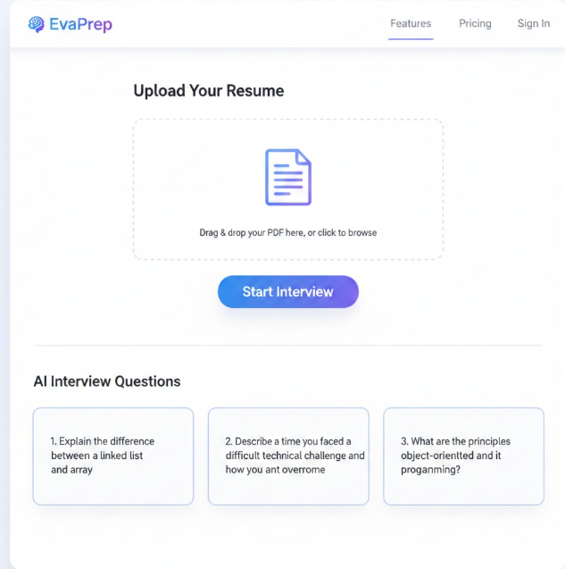

# Evalora MVP

## Description
Our MVP is a web app where a user uploads a resume and receives AI-generated interview questions with feedback.

## Demo Instructions
1. Clone the repository
2. Install required dependencies
3. Run the application locally
4. Upload a resume file
5. View AI-generated interview questions and feedback

## Tech Stack
- Frontend: HTML, CSS, JavaScript
- Backend: Node.js
- AI: OpenAI API

## Screenshot

